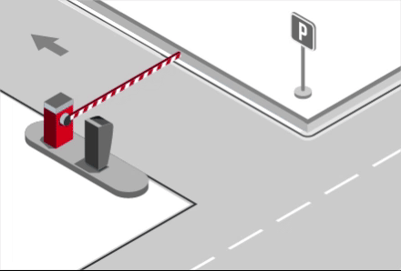
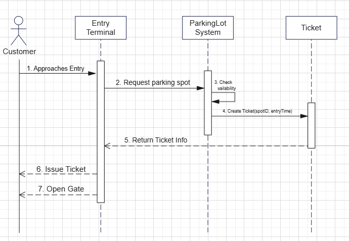
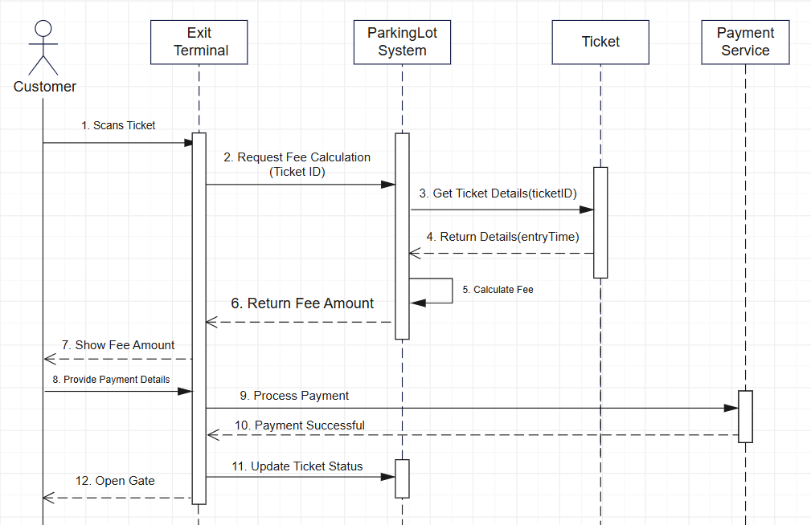

# Parking Lot Low Level Design

# Problem Statement

Design a Parking Lot system that can handle different types of vehicles, assign parking spots, generate tickets, and calculate parking fees.

---
LLD is not about jumping straight into classes and code. As humans, we cannot think of all the requirements at once, and that is completely fine. That is why asking the right questions is an important part of Low Level Design. These questions help us understand what the system should do before we decide how to design it. Instead of assuming everything upfront, we start with the basics and correct our understanding step by step as the design evolves.

---
> ## **Interviewer ↔ Candidate Clarification**
>
> **Candidate:** What types of vehicles will the parking lot support?  
> **Interviewer:** It will support three types of vehicles: Bike, Car, and Truck.  
>
> **Candidate:** Okay. So will there be different parking spots for different vehicle types?  
> **Interviewer:** Yes. Each vehicle type will have its own parking spot category: Compact, Regular, and Large.  
>
> **Candidate:** When a vehicle enters the parking lot, is the ticket generated at entry or at exit?  
> **Interviewer:** The ticket is generated at entry.  
>
> **Candidate:** Okay. So ticket generation happens at entry, and payment is done at exit, right?  
> **Interviewer:** Yes, that is correct.  
>
> **Candidate:** What pricing model should we follow? Hourly or flat rate?  
> **Interviewer:** We will use hourly pricing.  
>
> **Candidate:** Got it. That means we need to track the time from entry to exit. So the ticket should store the entry time, which we can later use to calculate the parking duration.  
> **Interviewer:** Yes.  
>
> **Candidate:** What payment methods should we support for now?  
> **Interviewer:** For now, cash payment is sufficient.  
>
> **Candidate:** One more question. What happens if the parking lot is already full? We should not issue a ticket in that case, right?  
> **Interviewer:** Yes. If there is no available parking spot, the system should not generate a ticket and should deny entry.  

---

After the discussion, the candidate writes down only what is confirmed.

---
## Story Time
Before jumping into diagrams or code, we write a simple story describing how the system works in real life.

While writing this story, we follow one simple rule:

+ Nouns represent classes
+ Verbs (action words) represent methods

This story helps us understand the complete flow from entry to exit without thinking about implementation details.

From the story above, we can identify the following key entities:

- Vehicle  
- Parking Lot  
- Parking Spot  
- Parking Ticket  
- Entrance  
- Exit  
- Payment  

These entities give us a clear idea of the core objects that will later turn into classes.

At the same time, the story also shows what actions are performed by the customer and what responsibilities are handled internally by the system. We will use this understanding directly in the next section while identifying the actors and defining the use cases.

---
# Use Case Diagram

As we saw in the story, the customer performs actions such as entering the parking lot, receiving a ticket, paying the parking fee, and exiting the system. These actions naturally translate into customer use cases.

In most low-level designs, we usually identify two primary actors:

+ Customer, who uses the system

+ Admin, who manages and configures the system

Both of these actors interact with the Parking Lot system, which handles tasks like ticket generation, spot assignment, fee calculation, and payment processing. Using this understanding, we can now model the system behavior using a use case diagram.

---

## Actors and Their Use Cases

Based on the discussion, we identify the following actors and their interactions with the Parking Lot system.

---

### 1. Admin

**Description:**  
The Admin is responsible for configuring and maintaining the parking lot.

**Admin Use Cases:**

- **Add parking spot**  
  Add a new parking spot by specifying its type (compact, regular, large) and location.

- **Remove parking spot**  
  Remove a parking spot from the system if it is unavailable due to maintenance or other reasons.

- **Update parking spot**  
  Modify the details of an existing parking spot, such as its type or availability status.

- **Manage pricing rules**  
  Configure or update hourly pricing rules based on vehicle or spot type.

---

### 2. Customer

**Description:**  
The Customer represents anyone who uses the parking lot to park a vehicle.

**Customer Use Cases:**

- **Take parking ticket**  
  Receive a parking ticket at the entrance, which records the vehicle information and entry time.

- **Park vehicle**  
  Park the vehicle in the parking spot assigned by the system.

- **Pay parking fee**  
  Pay the parking fee at exit based on the calculated parking duration.

- **Exit parking lot**  
  Exit the parking lot after successful payment.

---

### System Behavior

The following behaviors are handled internally by the Parking Lot system:

- Assign parking spot  
- Show available or full status  
- Calculate parking fee  
- Process payment  

These behaviors are represented as **included use cases** within customer actions in the use case diagram.

---
.png>)
---
# Sequence Diagram

After the use case diagram, the next step is to understand **how different parts of the system talk to each other**.  

Use case diagrams show **what actions are possible**.  
Sequence diagrams show **how those actions actually happen** step by step.

### Key Flows in the Parking Lot System

For the parking lot system, the complete user journey can be covered using two main sequences:

- Vehicle Entry

- Vehicle Exit and Payment

Together, these two flows represent the entire parking lifecycle.

---

## How Sequence Diagrams Help Identify Design Patterns

Sequence diagrams don’t just show flow.
If you observe them carefully, they help you reason about design decisions and spot patterns that keep appearing across different LLD problems.

Let’s go pattern by pattern and connect them with real thinking and other common LLD questions.

## Design Patterns Identified

## 1. Singleton Pattern

From the sequence diagrams, it becomes clear that there is a central `ParkingLot` system responsible for:

* Entry and exit requests
* Ticket creation
* Spot assignment
* Fee calculation

A key question arises:

> Should there be multiple `ParkingLot` instances?

Allowing multiple instances introduces inconsistencies such as:

* Disagreement on free vs occupied parking spots
* Duplicate spot assignments
* Ticket and state desynchronization

Since the parking lot models a physical, shared environment with a unified state, it is logical to use a single instance. This leads to the Singleton pattern.

> 💡 **LLD Recall**  
> Systems like Parking Lot, Vending Machine, Elevator System, or Game Board often benefit from Singleton when a single centralized controller drives the workflow.

---

## 2. Factory Pattern (Conceptual)

Sequence diagrams also highlight how certain objects are created during runtime:

* `ParkingTicket` is created when a vehicle enters.
* `Payment` is created when the customer exits and pays.

Important observations:

* These objects are not created at system startup.
* They are created when specific actions occur within the flow.
* Creation logic should not be scattered across objects.

This raises a design question:

> Who should create these objects?

Centralizing creation logic avoids fragmentation and supports extensibility. This aligns with the Factory approach, even if an explicit `TicketFactory` is not implemented yet.

> 💡 **LLD Recall**  
> Domains such as Vending, Food Ordering, Ride Booking, and Order Management frequently use Factory patterns for objects that vary at runtime based on inputs or conditions.

---

## 3. Strategy Pattern (Future Extension)

Sequence diagrams also isolate behaviors such as:

* Calculating parking fee
* Processing payment

At present, the system may support:

* Hourly pricing
* Cash payments

However, future requirements may introduce alternative policies:

* Different pricing models (flat rate, weekend pricing, vehicle-based pricing)
* Different payment methods (card, UPI, wallet, subscription)

Since these behaviors are isolated and interchangeable, Strategy becomes a natural candidate. Strategies allow changing implementations without modifying flow logic.

> 💡 **LLD Recall**  
> Systems with variable rules or policies — e.g., Chess, Pricing Engines, Discount Systems, Payment Systems — often benefit from Strategy when behavior changes independently of workflow.

---

