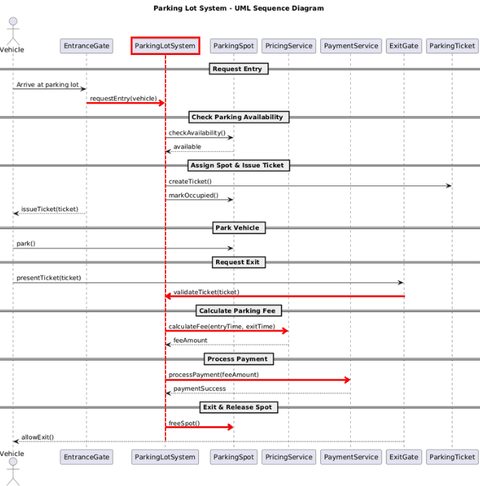
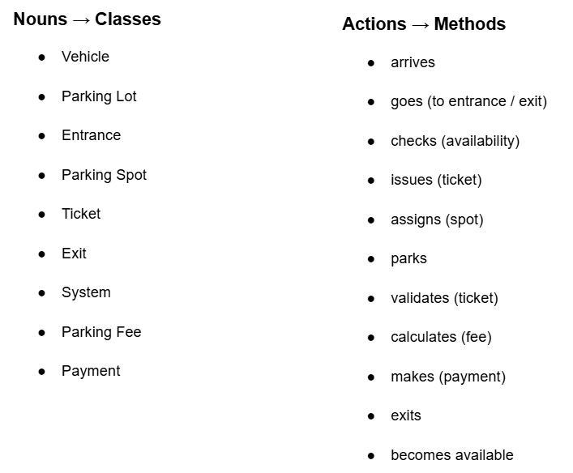

# Parking Lot Low lewel Design

## Problem Statement

Design a Parking Lot system that can handle different types of vehicles, assign parking spots, generate tickets, and calculate parking fees.

---
LLD is not about jumping straight into classes and code.
As humans, we cannot think of all the requirements at once — and we are not supposed to. That’s why asking the right questions is a crucial part of Low Level Design. These questions help us understand what the system should actually do before we think about how to design it. Instead of assuming things upfront, we clarify the basics first and let the design evolve step by step.

---

> **Interviewer ↔ Candidate Clarification**
>
> **Candidate:** What types of vehicles should this parking lot support?  
> **Interviewer:** The parking lot should support three types of vehicles: Bike, Car, and Truck.  
>
> **Candidate:** Okay. Then I’m assuming we’ll have different parking spots for different vehicle types, right?  
> **Interviewer:** Yes. Each vehicle type has its corresponding parking spot category: Compact, Regular, and Large.  
>
> **Candidate:** When a vehicle enters the parking lot, do we generate a ticket at entry or at exit?  
> **Interviewer:** The ticket is generated at entry.  
>
> **Candidate:** Okay. So I’m assuming ticket is generated at entry, and payment happens at exit, right?  
> **Interviewer:** Yes, that’s correct.  
>
> **Candidate:** What should be the pricing plan? Hourly or flat rate?  
> **Interviewer:** It will be hourly pricing.  
>
> **Candidate:** Got it. So we need to track the time from entry to exit. That implies the ticket should store the entry timestamp, which we’ll later use to calculate the parking duration.  
> **Interviewer:** Yes.  
>
> **Candidate:** And what payment methods should we support for now?  
> **Interviewer:** For now, cash payment is sufficient.  
>
> **Candidate:** One more thing — what if the parking lot is already full? In that case, we shouldn’t issue a ticket, right?  
> **Interviewer:** Yes. If there is no available parking spot, the system should not generate a ticket and should deny entry.  

---

After the discussion, the candidate writes down only what is confirmed.

---
## Story Time
Before jumping into diagrams or code, we write a simple story describing how the system works in real life.

While writing this story, we follow one simple rule:

+ Nouns represent classes
+ Verbs (action words) represent methods

This helps us naturally identify what objects exist in the system and what actions they can perform, without forcing any design upfront.

