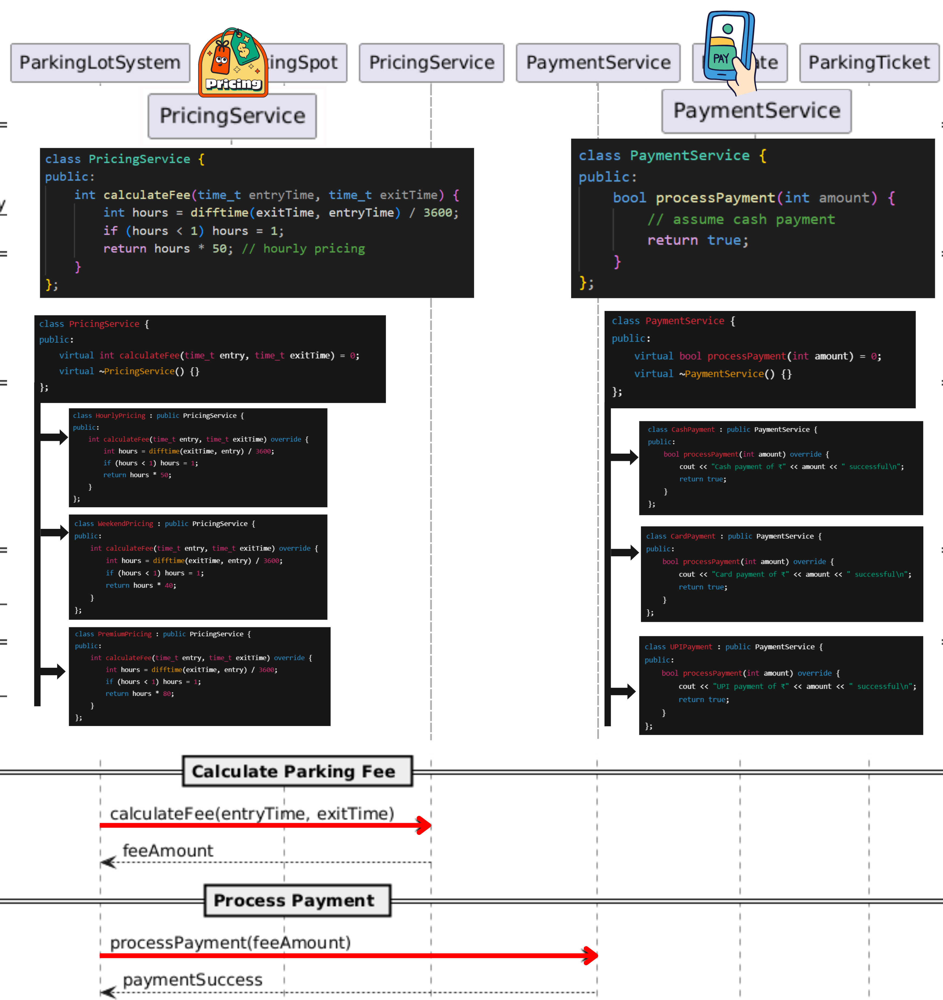

# Parking Lot Low Level Design


# Problem Statement

Design a Parking Lot system that can handle different types of vehicles, assign parking spots, generate tickets, and calculate parking fees.

---
LLD is not about jumping straight into classes and code. As humans, we cannot think of all the requirements at once, and that is completely fine. That is why asking the right questions is an important part of Low Level Design. These questions help us understand what the system should do before we decide how to design it. Instead of assuming everything upfront, we start with the basics and correct our understanding step by step as the design evolves.

---
> ## **Interviewer ↔ Candidate Clarification**
>
> **Candidate:** What types of vehicles will the parking lot support?  
> **Interviewer:** It will support three types of vehicles: Bike, Car, and Truck.  
>
> **Candidate:** Okay. So will there be different parking spots for different vehicle types?  
> **Interviewer:** Yes. Each vehicle type will have its own parking spot category: Compact, Regular, and Large.  
>
> **Candidate:** When a vehicle enters the parking lot, is the ticket generated at entry or at exit?  
> **Interviewer:** The ticket is generated at entry.  
>
> **Candidate:** Okay. So ticket generation happens at entry, and payment is done at exit, right?  
> **Interviewer:** Yes, that is correct.  
>
> **Candidate:** What pricing model should we follow? Hourly or flat rate?  
> **Interviewer:** We will use hourly pricing.  
>
> **Candidate:** Got it. That means we need to track the time from entry to exit. So the ticket should store the entry time, which we can later use to calculate the parking duration.  
> **Interviewer:** Yes.  
>
> **Candidate:** What payment methods should we support for now?  
> **Interviewer:** For now, cash payment is sufficient.  
>
> **Candidate:** One more question. What happens if the parking lot is already full? We should not issue a ticket in that case, right?  
> **Interviewer:** Yes. If there is no available parking spot, the system should not generate a ticket and should deny entry.  

---


After the discussion, the candidate writes down only what is confirmed.


---
## Story Time
Before jumping into diagrams or code, we write a simple story describing how the system works in real life.

While writing this story, we follow one simple rule:

+ Nouns represent classes
+ Verbs (action words) represent methods

This story helps us understand the complete flow from entry to exit without thinking about implementation details.


From the story above, we can identify the following key entities:

- Vehicle  
- Parking Lot  
- Parking Spot  
- Parking Ticket  
- Entrance  
- Exit  
- Payment  

These entities give us a clear idea of the core objects that will later turn into classes.


The story also makes it clear which actions are done by the customer and which are handled by the system.
In the next section, we use this clarity to observe how the system components talk to each other during the flow.

---
# Sequence Diagram

In the story section, we described the complete parking journey as a sequence of actions that happen from the moment a vehicle arrives until it leaves.

In this section, we represent the same story using a sequence diagram by breaking it into **clear system activities** such as requesting entry, assigning a parking spot, calculating the fee, and releasing the spot.

Each boxed section represents one activity, and the arrows show how different components interact in order.

Together, these activities visually represent the full parking flow described in the story.


---


## How Sequence Diagrams Help Identify Design Patterns

Sequence diagrams don’t just show flow.
If you observe them carefully, they help you reason about design decisions and spot patterns that keep appearing across different LLD problems.

Let’s go pattern by pattern and connect them with real thinking.


## Design Patterns Identified


## 1. One Central System Controls the Flow

What we see in the diagram?

* Vehicle talks to EntranceGate
* EntranceGate forwards to ParkingLotSystem
* ParkingLotSystem orchestrates everything: checks spots, creates tickets, calculates fees, processes payments
* All other components (ParkingSpot, PricingService, PaymentService) respond to ParkingLotSystem's requests


**Observation:**  
Every decision flows through ParkingLotSystem. No other component independently modifies parking state.

**Why this matters?**  
Without a central controller, problems arise:
- **Multiple entrance gates** could assign the same spot to different vehicles
- **Each gate with its own spot list** leads to inconsistent views of availability
- **Concurrent access** causes race conditions

**The solution:** One object manages shared data. All operations go through it.

```cpp
ParkingLotSystem system;
EntranceGate entrance1(&system);  // Same system
EntranceGate entrance2(&system);  // Same system
ExitGate exit(&system);            // Same system
```

> 💡 **LLD Recall**  
> When many components depend on the same data,
keep one central system in charge.   
(often implemented using Singleton)

>**Singleton**  
>*Use Singleton when only one object should exist and everyone in the program uses that same object.*
---

## 2. Objects Are Created Only When Needed

What we see in the diagram?

* System receives checkAvailability(vehicle) with the vehicle
* System must find the right type of spot:
    - Bike → Compact spot
    - Car → Regular spot
    - Truck → Large spot
* Spot type decision happens at runtime


**Observation:**
The exact spot type to create is determined dynamically based on vehicle type.


**Why this matters?**  
Without a factory, you'd write:
```cpp
if (vehicle->getType() == "Bike") {
    return new CompactSpot();
} else if (vehicle->getType() == "Car") {
    return new RegularSpot();
} else if (vehicle->getType() == "Truck") {
    return new LargeSpot();
}
```
Problems:
- Adding new vehicle types (Bus, Motorcycle) requires modifying this code
- Adding new spot types (Premium, Disabled) requires more conditions
- Mapping logic scattered across the codebase

*The solution:* Centralize creation logic in a factory.

```cpp
class ParkingSpotFactory {
    ParkingSpot* createSpot(string vehicleType) {
        // Creation logic in one place
    }
};
```


> 💡 **LLD Recall**  
> When objects are created as part of a flow,
keep their creation in one clear place.
(often implemented using Factory Method)

>**Factory Method**  
>*Use the Factory Method when the code asks for an object, and the program chooses which one to create at runtime.*

---

## 3. Rules Are Separate from the Main Flow

What we see in the diagram?

- System asks PricingService to calculate fees
- System asks PaymentService to process payments
- System doesn't contain pricing or payment logic itself


**Observation:**
Business rules are delegated to specialized services.

**Why this matters?**  
Rules evolve frequently:
   - Pricing: Flat rate → First hour free → Peak/off-peak → Member discounts
   - Payment: Cash → Cash + Card → Multiple payment methods → Subscriptions  

If pricing logic lives in ParkingLotSystem:
```cpp
void handleExit(ParkingTicket* ticket) {
    int hours = calculateHours(ticket);
    int fee = hours * 50;  // What if this rule changes?
    // Process payment...
}
```
Every rule change forces modification of ParkingLotSystem.

**The solution:** Separate strategies that can be swapped.
```cpp
class PricingStrategy {
    virtual int calculateFee(time_t entry, time_t exit) = 0;
};

class HourlyPricing : public PricingStrategy { ... };
class PeakHourPricing : public PricingStrategy { ... };
```
Now:
- Want weekend pricing? Create new strategy
- Want to switch at runtime? Change strategy
- ParkingLotSystem never changes

> 💡 **LLD Recall**  
> When algorithms vary and change independently from the main flow, encapsulate them as strategies.
(often implemented using Strategy Pattern)

>**Strategy**  
>*Use Strategy when you have multiple ways to do the same task, and you want to switch between them easily.*

---
## Patterns Summary

| When You See This in Future Designs                                   | Use This Pattern | Because                                                             |
|------------------------------------------------------------------------|------------------|---------------------------------------------------------------------|
| Multiple components need to access/modify shared data                  | Singleton        | Prevents inconsistent state and ensures a single source of truth    |
| Object types determined at runtime based on conditions                 | Factory Method   | Centralizes creation logic and makes the system extensible           |
| Business rules/algorithms that change frequently and independently     | Strategy         | Isolates changing behavior from stable flow                          |


# Code Implementation

## Phase 1: Nouns->Classes
From the story, I clearly see these nouns:

- Vehicle
- ParkingLotSystem
- EntranceGate
- ParkingSpot
- ParkingTicket
- ExitGate
- PricingService
- PaymentService

1) Vehicle (A vehicle arrives at the parking lot.)
```cpp
class Vehicle {
private:
    string number;

public:
    Vehicle(string number) : number(number) {}

    string getNumber() const {
        return number;
    }
};
```

2) ParkingLotSystem (The parking lot system manages parking spots and tickets.)
```cpp
class ParkingLotSystem {
    // will fill later
};
```
3) EntranceGate (The entrance gate issues parking tickets.)
```cpp
class EntranceGate {
public:
    // entry-related behavior will go here
};
```
4) ParkingSpot (The vehicle parks in an assigned spot.)
>A parking spot just stores state: free or occupied.
It should NOT make decisions.
```cpp
class ParkingSpot {
private:
    int id;
    bool isFree;

public:
    ParkingSpot(int id) : id(id), isFree(true) {}

    bool available() const {
        return isFree;
    }

    void markOccupied() {
        isFree = false;
    }

    void release() {
        isFree = true;
    }

    int getId() const {
        return id;
    }
};
```
5) ParkingTicket (The parking ticket records entry time and spot.)
```cpp
#include <ctime>

class ParkingTicket {
private:
    Vehicle* vehicle;
    ParkingSpot* spot;
    time_t entryTime;

public:
    ParkingTicket(Vehicle* v, ParkingSpot* s)
        : vehicle(v), spot(s), entryTime(time(nullptr)) {}

    Vehicle* getVehicle() const {
        return vehicle;
    }

    ParkingSpot* getSpot() const {
        return spot;
    }

    time_t getEntryTime() const {
        return entryTime;
    }
};
```
6) ExitGate, PricingService, PaymentService
```cpp
class ExitGate {};
class PricingService {};
class PaymentService {};
```
## Phase 2: Identify Design Patterns
Now I’ll walk through the sequence diagram top to bottom and connect these classes.

**Step 1: Singleton — One Central System Controls the Flow**

First, I connect all the main actions to one system object.
What does the system need to remember?

  

In the diagram, both the entrance and exit always talk to the same ParkingLotSystem.  
That system holds all shared data like spots, pricing, and payments.  
So no matter where a vehicle enters or exits, every decision uses the same state.

```cpp
#include <vector>

class ParkingLotSystem {
private:
    vector<ParkingSpot*> spots;
    PricingService* pricingService;
    PaymentService* paymentService;

public:
    ParkingLotSystem(PricingService* pricing,
                     PaymentService* payment)
        : pricingService(pricing),
          paymentService(payment) {}

    void addSpot(ParkingSpot* spot) {
        spots.push_back(spot);
    }

    ParkingTicket* handleEntry(Vehicle* vehicle);

    void handleExit(ParkingTicket* ticket);
};
```
Now update the gates so they talk to the same system object.
```cpp
class EntranceGate {
private:
    ParkingLotSystem* system;

public:
    EntranceGate(ParkingLotSystem* system)
        : system(system) {}

    ParkingTicket* enter(Vehicle* vehicle) {
        return system->handleEntry(vehicle);
    }
};

class ExitGate {
private:
    ParkingLotSystem* system;

public:
    ExitGate(ParkingLotSystem* system)
        : system(system) {}

    void exit(ParkingTicket* ticket) {
        system->handleExit(ticket);
    }
};
```

**Step 2: Factory — Creating Flow-Driven Objects in One Place**

A ParkingTicket is created only when a vehicle enters.
So we don’t want:

- new ParkingTicket() scattered everywhere
- Vehicle or spot creating tickets

Here:
- ParkingLotSystem decides when to create a ticket
- EntranceGate handles issuing the ticket


  

The ticket is created by `ParkingLotSystem` using the `createTicket()` method only after a vehicle enters,
so the system decides at runtime whether a ticket is needed and what to create.

```cpp
class ParkingLotSystem {
private:
    vector<ParkingSpot*> spots;
    PricingService* pricingService;
    PaymentService* paymentService;

    // Factory-style creation
    ParkingTicket* createTicket(Vehicle* vehicle, ParkingSpot* spot) {
        return new ParkingTicket(vehicle, spot);
    }

public:
    ParkingLotSystem(PricingService* pricing,
                     PaymentService* payment)
        : pricingService(pricing),
          paymentService(payment) {}

    void addSpot(ParkingSpot* spot) {
        spots.push_back(spot);
    }

    ParkingTicket* handleEntry(Vehicle* vehicle) {
        for (auto spot : spots) {
            if (spot->available()) {
                spot->markOccupied();
                return createTicket(vehicle, spot);
            }
        }
        return nullptr; // parking full
    }

    void handleExit(ParkingTicket* ticket);
};
```
**Step 3: Strategy — Rules Are Separate from the Flow**

From the sequence diagram:

  


Pricing and payment are kept in separate services because their rules change often.  
Over time, pricing can grow from hourly to weekend or premium models, and payments can expand from cash to card or UPI.  
Since these options live under `PricingService` and `PaymentService`, new choices can be added without touching the main parking flow.

```cpp
class PricingService {
public:
    int calculateFee(time_t entryTime, time_t exitTime) {
        int hours = difftime(exitTime, entryTime) / 3600;
        if (hours < 1) hours = 1;
        return hours * 50; // hourly pricing
    }
};
```
```cpp
class PaymentService {
public:
    bool processPayment(int amount) {
        // assume cash payment
        return true;
    }
};
```
Now complete the exit flow in ParkingLotSystem:
```cpp
void ParkingLotSystem::handleExit(ParkingTicket* ticket) {
    int fee = pricingService->calculateFee(
        ticket->getEntryTime(),
        time(nullptr)
    );

    if (paymentService->processPayment(fee)) {
        ticket->getSpot()->release();
    }
}
```
## Phase 3: main() Function to Tie It All Together

```cpp
int main() {
    PricingService pricingService;
    PaymentService paymentService;

    ParkingLotSystem system(&pricingService, &paymentService);

    system.addSpot(new ParkingSpot(1));
    system.addSpot(new ParkingSpot(2));

    EntranceGate entrance(&system);
    ExitGate exitGate(&system);

    Vehicle car("KA-01-1234");

    ParkingTicket* ticket = entrance.enter(&car);

    if (ticket) {
        exitGate.exit(ticket);
    }

    return 0;
}
```
