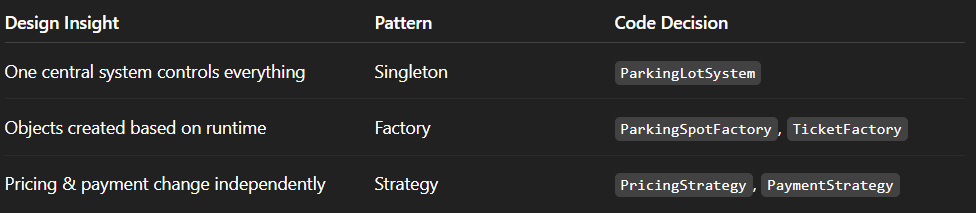

# Parking Lot Low Level Design


# Problem Statement

Design a Parking Lot system that can handle different types of vehicles, assign parking spots, generate tickets, and calculate parking fees.

---
LLD is not about jumping straight into classes and code. As humans, we cannot think of all the requirements at once, and that is completely fine. That is why asking the right questions is an important part of Low Level Design. These questions help us understand what the system should do before we decide how to design it. Instead of assuming everything upfront, we start with the basics and correct our understanding step by step as the design evolves.

---
> ## **Interviewer ↔ Candidate Clarification**
>
> **Candidate:** What types of vehicles will the parking lot support?  
> **Interviewer:** It will support three types of vehicles: Bike, Car, and Truck.  
>
> **Candidate:** Okay. So will there be different parking spots for different vehicle types?  
> **Interviewer:** Yes. Each vehicle type will have its own parking spot category: Compact, Regular, and Large.  
>
> **Candidate:** When a vehicle enters the parking lot, is the ticket generated at entry or at exit?  
> **Interviewer:** The ticket is generated at entry.  
>
> **Candidate:** Okay. So ticket generation happens at entry, and payment is done at exit, right?  
> **Interviewer:** Yes, that is correct.  
>
> **Candidate:** What pricing model should we follow? Hourly or flat rate?  
> **Interviewer:** We will use hourly pricing.  
>
> **Candidate:** Got it. That means we need to track the time from entry to exit. So the ticket should store the entry time, which we can later use to calculate the parking duration.  
> **Interviewer:** Yes.  
>
> **Candidate:** What payment methods should we support for now?  
> **Interviewer:** For now, cash payment is sufficient.  
>
> **Candidate:** One more question. What happens if the parking lot is already full? We should not issue a ticket in that case, right?  
> **Interviewer:** Yes. If there is no available parking spot, the system should not generate a ticket and should deny entry.  

---


After the discussion, the candidate writes down only what is confirmed.


---
## Story Time
Before jumping into diagrams or code, we write a simple story describing how the system works in real life.

While writing this story, we follow one simple rule:

+ Nouns represent classes
+ Verbs (action words) represent methods

This story helps us understand the complete flow from entry to exit without thinking about implementation details.


From the story above, we can identify the following key entities:

- Vehicle  
- Parking Lot  
- Parking Spot  
- Parking Ticket  
- Entrance  
- Exit  
- Payment  

These entities give us a clear idea of the core objects that will later turn into classes.


The story also makes it clear which actions are done by the customer and which are handled by the system.
In the next section, we use this clarity to observe how the system components talk to each other during the flow.

---
# Sequence Diagram

In the story section, we described the complete parking journey as a sequence of actions that happen from the moment a vehicle arrives until it leaves.

In this section, we represent the same story using a sequence diagram by breaking it into **clear system activities** such as requesting entry, assigning a parking spot, calculating the fee, and releasing the spot.

Each boxed section represents one activity, and the arrows show how different components interact in order.

Together, these activities visually represent the full parking flow described in the story.


---


## How Sequence Diagrams Help Identify Design Patterns

Sequence diagrams don’t just show flow.
If you observe them carefully, they help you reason about design decisions and spot patterns that keep appearing across different LLD problems.

Let’s go pattern by pattern and connect them with real thinking and other common LLD questions.


## Design Patterns Identified


## 1. One Central System Controls the Flow

What we see in the diagram?

```
Vehicle talks to EntranceGate
EntranceGate forwards request to System
System talks to Spot, Ticket, Pricing, Payment
```
**Observation:**

* All important decisions happen in one place
* Other objects are only helping, not deciding

**Why this matters?**  
If multiple such system objects existed,
each could have a different view of available spots and tickets.


> 💡 **LLD Recall**  
> When many components depend on the same data,
keep one central system in charge.   
(often implemented using Singleton)

>**Singleton**  
>*Use Singleton when exactly one object
must control shared data or behavior
across the entire system.*
---

## 2. Objects Are Created Only When Needed

What we see in the diagram?
```
System checks parking availability
If a suitable spot is found:
    System creates a ParkingSpot
    System creates a ParkingTicket
```

**Observation:**
* Parking spots and tickets are created when a vehicle comes in
* The system chooses the right type based on the vehicle
* All creation happens in one place

**Why this matters?**  
If ticket creation logic is spread across multiple classes,
the system becomes tightly coupled to concrete classes and full of if-else checks.

(e.g., different ticket types, digital tickets, subscriptions).

> 💡 **LLD Recall**  
> When objects are created as part of a flow,
keep their creation in one clear place.
(often implemented using Factory Method)

>**Factory Method**  
>*Use the Factory Method when you don’t know beforehand
which exact object needs to be created,
and that decision depends on runtime conditions.*

---

## 3. Rules Are Separate from the Main Flow

What we see in the diagram?
```
System asks PricingService to calculate the fee
System asks PaymentService to process the payment
```
**Observation:**
* The system does not calculate the fee itself
* The system does not handle payment logic itself
* These rules are handled by separate components

**Why this matters?**  
Pricing and payment rules change often,
but the parking flow usually stays the same.
Keeping rules separate makes changes easy.

> 💡 **LLD Recall**  
> When rules can change,
keep them separate from the main flow  
(often implemented using Strategy-style behavior)

>**Strategy**  
>*Use Strategy when you have different ways to do the same task and you want to switch between them without changing the main code.*

---


# Code Implementation

```python
from abc import ABC, abstractmethod
from enum import Enum
import time
```
# Vehicle Class
````python
class Vehicle:
    def __init__(self, number, vehicle_type):
        self._number = number
        self._type = vehicle_type

    def get_type(self):
        return self._type

````
`````python
class VehicleType(Enum):
    BIKE = 1
    CAR = 2
    TRUCK = 3


class SpotType(Enum):
    COMPACT = 1
    REGULAR = 2
    LARGE = 3
`````

>💡 **Enum**  
>Use enum when the options are **fixed** and will not change.
It only tells what type it is, no logic inside.


# ParkingSpot Class
```python
class ParkingSpot:
    def __init__(self, spot_id, spot_type):
        self._id = spot_id
        self._type = spot_type
        self._occupied = False

    def is_available(self):
        return not self._occupied

    def occupy(self):
        self._occupied = True

    def free(self):
        self._occupied = False

    def get_type(self):
        return self._type
```

>🪝 **Hook 1**  
ParkingSpot only stores state.  
No decisions here.

# ParkingTicket Class
```python

class ParkingTicket:
    def __init__(self, ticket_id, vehicle, spot):
        self._ticket_id = ticket_id
        self._vehicle = vehicle
        self._spot = spot
        self._entry_time = time.time()

    def get_entry_time(self):
        return self._entry_time

    def get_spot(self):
        return self._spot

    def get_ticket_id(self):
        return self._ticket_id
```


# Pricing Strategy Classes
```python
class PricingStrategy(ABC):
    @abstractmethod
    def calculate_fee(self, entry_time, exit_time):
        pass
class HourlyPricing(PricingStrategy):
    def calculate_fee(self, entry_time, exit_time):
        hours = (exit_time - entry_time) / 3600
        if hours < 1:
            hours = 1
        return hours * 50
```

>💡 **Abstract Class**  
Use abstract class when **logic can change**, but method name stays same.
It tells what work must be done, not how.

>🪝 **Hook 2**  
Logic can change, method name should not.  
Strategy pattern.

# Payment Strategy Classes
```python
class PaymentService(ABC):
    @abstractmethod
    def pay(self, amount):
        pass
class CashPayment(PaymentService):
    def pay(self, amount):
        print(f"Cash payment received: ₹{amount}")
        return True
```

# ParkingLotSystem Class
```python
class ParkingLotSystem:
    _instance = None


    def __init__(self):
        if ParkingLotSystem._instance:
            raise Exception("Use get_instance()")

        self._spots = []
        self._tickets = {}
        self._ticket_counter = 1
        self._pricing_strategy = HourlyPricing()

    @staticmethod
    def get_instance():
        if not ParkingLotSystem._instance:
            ParkingLotSystem._instance = ParkingLotSystem()
        return ParkingLotSystem._instance
```
>🪝 **Hook 3**  
>Only one parking lot object should exist, otherwise data will mismatch.  
Singleton avoids confusion.

## Spot Assignment Logic
```python
    def _find_spot(self, vehicle_type):
        mapping = {
            VehicleType.BIKE: SpotType.COMPACT,
            VehicleType.CAR: SpotType.REGULAR,
            VehicleType.TRUCK: SpotType.LARGE
        }

        for spot in self._spots:
            if spot.get_type() == mapping[vehicle_type] and spot.is_available():
                return spot
        return None
```
```python
    def add_spot(self, spot):
        self._spots.append(spot)

    def park_vehicle(self, vehicle):
        spot = self._find_spot(vehicle.get_type())
        if not spot:
            print("Parking Full")
            return None

        spot.occupy()
        ticket = ParkingTicket(self._ticket_counter, vehicle, spot)
        self._tickets[self._ticket_counter] = ticket
        print(f"Ticket generated: {self._ticket_counter}")
        self._ticket_counter += 1
        return ticket
```
## Exit Flow
```python
    def exit_vehicle(self, ticket_id, payment_service):
        if ticket_id not in self._tickets:
            print("Invalid Ticket")
            return

        ticket = self._tickets[ticket_id]
        fee = self._pricing_strategy.calculate_fee(
            ticket.get_entry_time(), time.time()
        )

        if payment_service.pay(fee):
            ticket.get_spot().free()
            del self._tickets[ticket_id]
            print("Exit successful")

```
## Gates
```python
class EntranceGate:
    def enter(self, vehicle):
        return ParkingLotSystem.get_instance().park_vehicle(vehicle)


class ExitGate:
    def exit(self, ticket_id):
        ParkingLotSystem.get_instance().exit_vehicle(ticket_id, CashPayment())
```
>🪝 **Hook 4**  
**Why Gates?**  
Real parking lots have many entry and exit points.
Gates act as a common entry point to the system.   
If there are no gates, every entry point will directly call ParkingLotSystem.
Each entry may add its own checks and logic.
Same logic gets written again and again in different places.
When rules change, we must update code in many places.
This increases bugs and makes the system hard to maintain.

```python
if __name__ == "__main__":
    parking_lot = ParkingLotSystem.get_instance()

    parking_lot.add_spot(ParkingSpot(1, SpotType.COMPACT))
    parking_lot.add_spot(ParkingSpot(2, SpotType.REGULAR))
    parking_lot.add_spot(ParkingSpot(3, SpotType.LARGE))

    vehicle = Vehicle("KA01AB1234", VehicleType.CAR)

    entrance = EntranceGate()
    ticket = entrance.enter(vehicle)

    if ticket:
        exit_gate = ExitGate()
        exit_gate.exit(ticket.get_ticket_id())
```